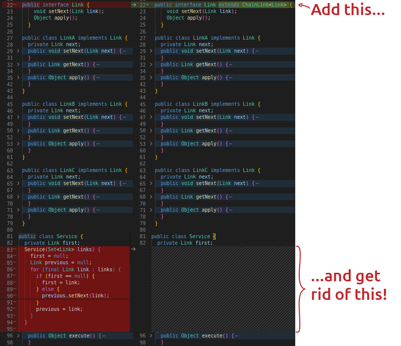

# Chain Of Responsibility (COR) Bean Processor Spring Boot Starter

**TL;DR:** You focus on the logic while we handle the chain!



# What is this about?
COR Bean Processor is a library to assist creating [Chain Of Responsibility design patterns](https://en.wikipedia.org/wiki/Chain-of-responsibility_pattern) on Spring
Boot projects. It automatically chain all links together, reducing the amount of non-business code required in the project.

# How to use it?

1. Be sure to add [Spring Boot](https://spring.io/guides/gs/spring-boot/) to
   your project.
2. Add COR Bean Processor Spring Boot Starter on your project.
    1. For Maven projects add the following on your `pom.xml` file
       under `<dependencies>` tag.
   ```xml
   <dependency>
     <groupId>com.figtreelake</groupId>
     <artifactId>cor-bean-processor-spring-boot-starter</artifactId>
     <version>1.0</version>
   </dependency>
   ```

    2. For Gradle projects add the following on your `build.gradle` file
       under `dependencies` declaration.
   ```groovy
   implementation 'com.figtreelake:cor-bean-processor-spring-boot-starter:1.0'
   ```
    3. You can check the latest version available
       on [Maven Central repository](https://mvnrepository.com/repos/central).
3. Make your Chain Of Responsibility link classes implement [ChainLink][1]
   interface.
4. Add a [ChainLink][1] interface field on the class where ou need your chain and annotate it with either [@Autowired](https://docs.spring.io/spring-framework/docs/current/javadoc-api/org/springframework/beans/factory/annotation/Autowired.html) or [@Inject](https://docs.oracle.com/javaee/6/api/javax/inject/Inject.html) (if you are using Javax Inject) 
5. That is it! COR Bean Processor will automatically create the chain and Spring Boot will inject its first list into the target class.

If you need further details about implementation, feel free to check [the examples repository](https://github.com/MarceloLeite2604/cor-bean-processor-examples). 

# FAQ

***Q:** Does COR Bean Processor handles multiple chains?*

**A:** Yes! As long as each [ChainLink][1] implementation declares a different type on its template, the library will concatenate each link group separately. For more details about it check [multiple chains project inside the example repository](https://github.com/MarceloLeite2604/cor-bean-processor-examples/tree/main/multiple-chains-example).

<br/>

***Q:** What if my links must be concatenated in a specific order?*

**A:** You can annotate your links with [@Order](https://docs.spring.io/spring-framework/docs/current/javadoc-api/org/springframework/core/annotation/Order.html). The library will respect the specification and chain links in the defined order. For more details check [ordered links inside the example repository](https://github.com/MarceloLeite2604/cor-bean-processor-examples/tree/main/chain-with-ordered-links-example). 

<br/>

***Q:** I need one link to be the first of my chain. Do I need to add [@Order](https://docs.spring.io/spring-framework/docs/current/javadoc-api/org/springframework/core/annotation/Order.html) annotation on all my links?*

**A:** No. Just add [@Primary](https://docs.spring.io/spring-framework/docs/current/javadoc-api/org/springframework/context/annotation/Primary.html) annotation on your first link and the library will use it as the first chain element. For more details check [chain with primary link example](https://github.com/MarceloLeite2604/cor-bean-processor-examples/tree/main/chain-with-primary-link-example).

## How can I contribute?

Try out the library. If you like the outcome, give a star for its repository, share or talk about it with your IT friends and colleagues. This is a work I have been doing in my spare time and I really would like to see that people appreciate the time I have invested on it.

If you liked the project and *really* want to demonstrate your appreciation, you can send me a "thank you" coffee. 🙂

[](https://www.paypal.com/donate/?hosted_button_id=C6LPXWCHGRUVQ)

## Sources

This library was implemented after
reading [Spring Boot - Auto Configuration](https://docs.spring.io/spring-boot/docs/1.3.8.RELEASE/reference/html/using-boot-auto-configuration.html)
and [Spring Boot Features - Developing Auto Configuration](https://docs.spring.io/spring-boot/docs/2.0.0.M3/reference/html/boot-features-developing-auto-configuration.html#boot-features-custom-starter)
documentation sections.

Also, thanks to [Stéphane Nicoll](https://github.com/snicoll) and
his [spring-boot-master-auto-configuration](https://github.com/snicoll/spring-boot-master-auto-configuration)
repository which helped me understand the minor details necessary to create a
Spring starter library.

[1]: ./autoconfigure/src/main/java/com/figtreelake/corbeanprocessor/autoconfigure/link/ChainLink.java